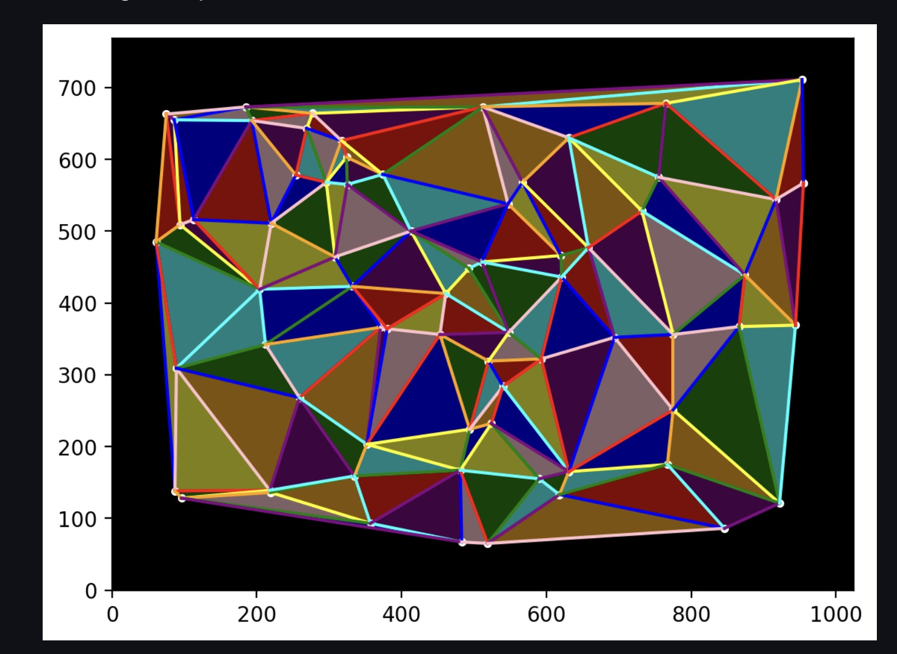
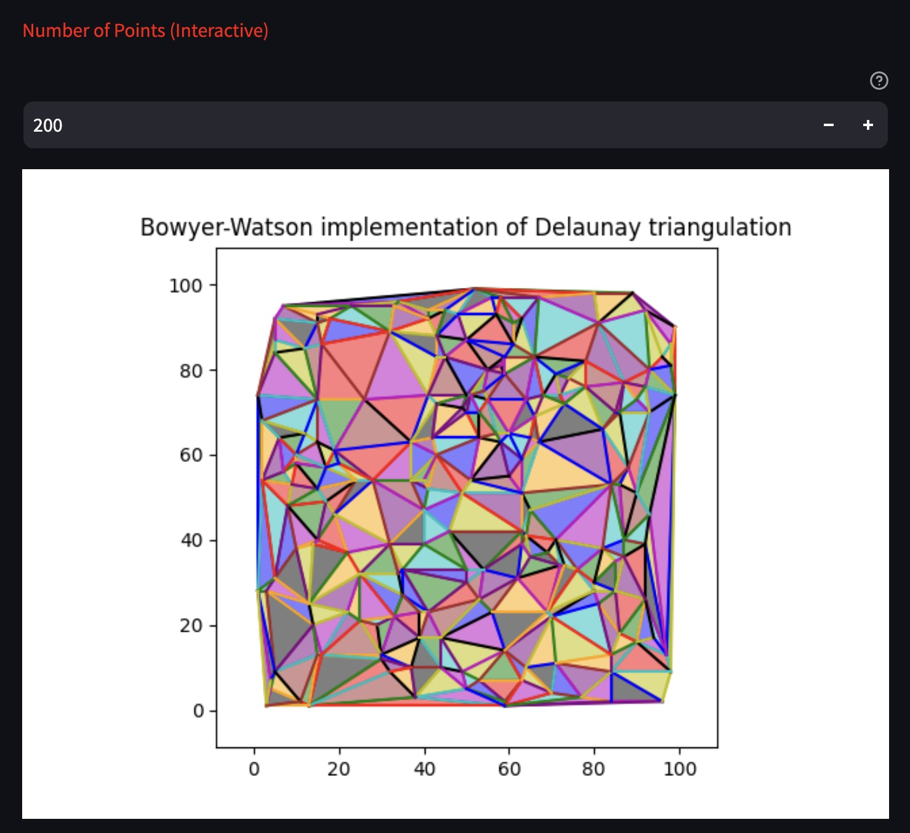

# ada-ait-voronoi

# Implementation of Voronoi diagram using naive and Bowyer-Watson algorithm.


### Steps to run the project:

1. ```conda create --name env-ada-ait-voronoi python=3.6```

2. ```conda actiate env-ada-ait-voronoi```

3. ```pip install -r requirements.txt```

4. ```python main.py```


### Screenshot

Voronoi implemented by naive algorithm

Voronoi using Bowyer-Watson Implementation

Voronoi usecase
