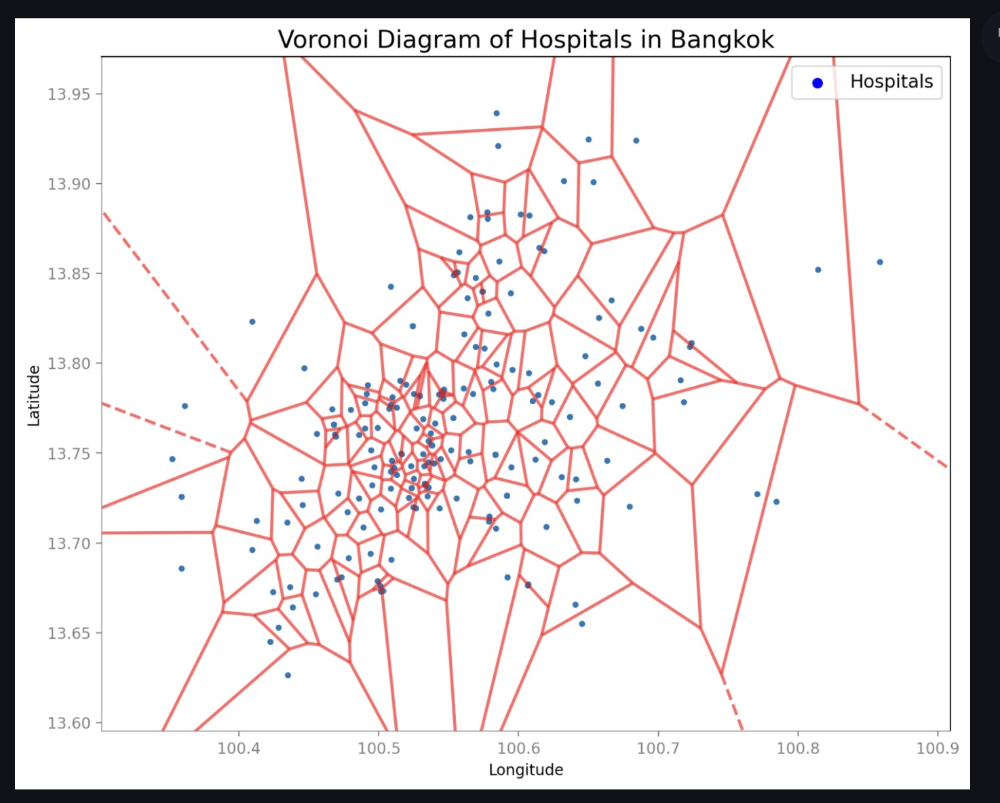

# ada-ait-voronoi


### Hosted at : https://biraj094-ada-ait-voronoi-main-xt6qhr.streamlit.app/

# Implementation of Voronoi diagram using naive and Bowyer-Watson algorithm.

[Youtube Video](https://www.youtube.com/watch?v=oL1RcVN7rtY)

[Github Repository Link](https://github.com/biraj094/ada-ait-voronoi)

[Deployment Link](https://biraj094-ada-ait-voronoi-main-xt6qhr.streamlit.app/)

[Google Drive Link](https://drive.google.com/drive/folders/1lkwUddPqlsf6YyYqw6zcABtT3b9tGr2-)


### Steps to run the project:

1. ```conda create --name env-ada-ait-voronoi python=3.6```

2. ```conda actiate env-ada-ait-voronoi```

3. ```pip install -r requirements.txt```

4. ```python main.py```


### Screenshot

#### Voronoi implemented by naive algorithm

#### Voronoi using Bowyer-Watson Implementation

#### Voronoi usecase


